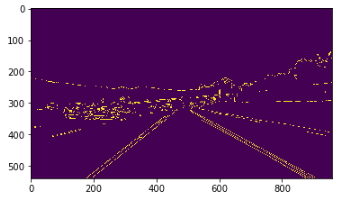
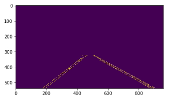
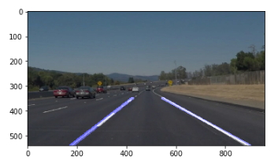

**Finding Lane Lines on the Road** 

When we drive, we use our eyes to decide where to go.  The lines on the road that show us where the lanes are act as our constant reference for where to steer the vehicle.  Naturally, one of the first things we would like to do in developing a self-driving car is to automatically detect lane lines using an algorithm.

This project is the first one in Undacity's Self Driving Car Nanodegree program.  In this project I detected lane lines in images using Python and OpenCV.  OpenCV means "Open-Source Computer Vision", which is a package that has many useful tools for analyzing images. 

The code can be found in the Jupyter Notebook "Term1-LaneLines-Kocsis.ipynb".  Please note, this was my first every project with Python and Jupyter Notebook.

**Step 1:** Preparing the image for detection

For the first part of this project, I converted the image to grayscale using OpenCV.  I then did a color dropout of all pixels below a certain threshold:
*    red_threshold = 150
*    green_threshold = 150
*    blue_threshold = 150

Canny edge image

**Step 2:**Define a region of interest

For this part of the project, I used OpenCV again to place a polygon on the image to mask out everything we are not interested in.  I did not use hardcoded pixel points and instead created points which will adapt to different sized images.

**Step 3:** Detect and draw the lines back on the image 

I then had to detect the lines.  For this, I had to apply a gaussian blur and then use openCV Hough Transoform to detect the lines.  Once the lines were detected I then had to grab the start point of the line, the angle of the line, and extend it to the top of the image mask.  This was done so broken lane lines would appear as full lines.

Final Image

Overall this project was a great way to dive into Python as well as Computer Vision. 
